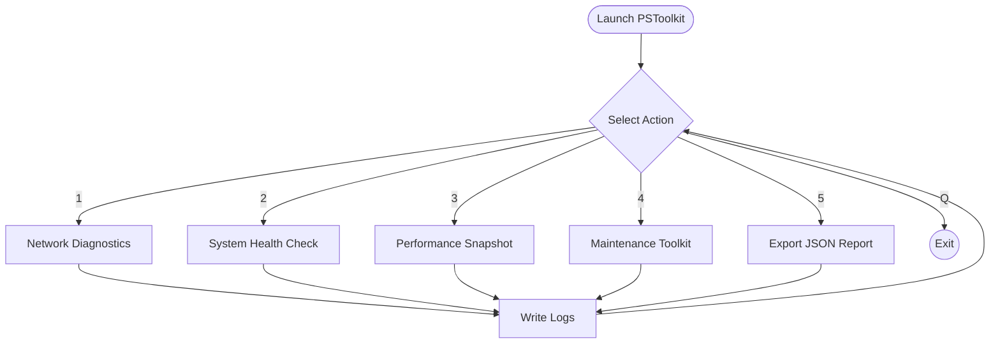

# PSToolkit

[](LICENSE) [](#installation) [](https://github.com/your-org/PSToolkit/commits/main) [](https://github.com/your-org/PSToolkit/releases)

> **TL;DR:** PSToolkit is a menu-driven Windows PowerShell toolkit that accelerates remote desktop support by combining diagnostics, performance checks, and routine maintenance with automated logging and structured exports.

---

## Demo

> Visuals coming soon — replace the placeholders below with live assets from `docs/`.


| Screenshot | Description |
| --- | --- |
|  | Menu-driven interface for all support actions. |
|  | Consolidated diagnostics with timestamped log capture. |
|  | Structured JSON export ready for ticketing systems. |

---

## Features

- [x] Guided, keyboard-driven workflow for support engineers
- [x] Automated transcript logging with rotation safeguards
- [x] Optional JSON exports for incident documentation
- [x] Cross-version support for Windows PowerShell 5.1 and PowerShell 7+
- [x] Graceful error handling with actionable exit codes

### Action Matrix

| Action | What it does | Logs / JSON fields produced | Estimated run time |
| --- | --- | --- | --- |
| **Network Diagnostics** | Captures IP config, gateway reachability, DNS resolution tests. | `network.ipv4`, `network.ipv6`, `network.gateway`, `network.dnsTests[]`. | 30–60 seconds |
| **System Health Check** | Retrieves OS build, uptime, pending reboots, critical events. | `system.osVersion`, `system.uptimeMinutes`, `system.pendingReboot`, `events.critical[]`. | 20–40 seconds |
| **Performance Snapshot** | Samples CPU, memory, disk queue, and top processes. | `performance.cpuLoad`, `performance.memoryUsage`, `performance.topProcesses[]`. | 15–30 seconds |
| **Maintenance Toolkit** | Offers cache cleanup, spooler reset, Windows Update log retrieval. | `maintenance.actions[]`, `maintenance.results[]`. | 1–3 minutes (depends on selected task) |
| **Custom Script Runner** | Executes predefined remediation scripts from `scripts/`. | `scripts.name`, `scripts.status`, `scripts.output`. | Varies by script |

---

## Installation

### 1. Prepare Execution Policy

```powershell
Set-ExecutionPolicy -Scope CurrentUser -ExecutionPolicy RemoteSigned
```

> Revert after installation if your organization mandates stricter policies.

### 2. Choose Your PowerShell Engine

- **Windows PowerShell 5.1** (built into Windows 10/11). Fully supported, requires .NET Framework.
- **PowerShell 7+** (cross-platform). Recommended for modern environments; unlocks faster remoting and updated cmdlets.

> PSToolkit auto-detects the host version and adapts menu rendering and JSON serialization accordingly.

### 3. Download PSToolkit

**Option A – Clone the repo**

```powershell
git clone https://github.com/your-org/PSToolkit.git
cd PSToolkit
```

**Option B – Download a release ZIP**

1. Visit [GitHub Releases](https://github.com/your-org/PSToolkit/releases).
2. Download the latest `PSToolkit.zip`.
3. Extract to a working directory, e.g., `C:\Tools\PSToolkit`.

---

## Quickstart

1. Launch a PowerShell console (5.1 or 7+). Run as Administrator if you plan to execute privileged actions.
2. Navigate to the extracted toolkit directory.
3. Start the menu:

```powershell
.\PSToolkit.ps1
```

### Interactive Session

```text
=== PSToolkit ===
1) Network Diagnostics
2) System Health Check
3) Performance Snapshot
4) Maintenance Toolkit
5) Export JSON Report
Q) Quit
Select an option: 1
```

### Non-Interactive Mode

Use flags to run a single action and exit:

```powershell
.\PSToolkit.ps1 -Action NetworkDiagnostics -ExportJson -JsonPath .\Outputs\Reports\netdiag.json -Verbose
```

---

## Usage Details

### Menu Flow



### Command-Line Flags

| Flag | Type | Default | Description |
| --- | --- | --- | --- |
| `-Action` | `string` | `""` | Optional. Specify an action key (`NetworkDiagnostics`, `SystemHealth`, `Performance`, `Maintenance`, `ExportJson`). |
| `-ExportJson` | `switch` | `False` | Toggle JSON export for the current run. |
| `-JsonPath` | `string` | `Outputs\Reports\PSToolkit.json` | Target path for JSON export. Creates folders as needed. |
| `-LogPath` | `string` | `Outputs\Logs` | Custom directory for log output. |
| `-ConfigPath` | `string` | `config.json` | Alternative configuration file. |
| `-Verbose` | `switch` | `False` | Enable verbose logging for troubleshooting. |
| `-WhatIf` | `switch` | `False` | Simulate actions without applying system changes (where supported). |

### JSON Export Schema

```jsonc
{
  "runId": "2023-09-21T19-04-55Z",
  "host": {
    "computerName": "WORKSTATION-01",
    "userName": "contoso\\jdoe",
    "powerShellVersion": "7.3.3"
  },
  "actions": [
    {
      "name": "NetworkDiagnostics",
      "status": "Success",
      "durationSeconds": 52,
      "output": {
        "ipv4": "192.168.1.25",
        "gatewayReachable": true,
        "dnsTests": [
          { "target": "contoso.com", "latencyMs": 31 },
          { "target": "8.8.8.8", "latencyMs": 18 }
        ]
      }
    }
  ]
}
```

### Log Files

- **Default location:** `Outputs/Logs/<timestamp>-PSToolkit.log`
- **Rotation:** The last 20 logs are preserved. Older logs are zipped into `Outputs/Logs/archive/` with the pattern `<timestamp>.zip`.
- **Transcript:** A PowerShell transcript (`Outputs/Logs/<timestamp>-transcript.txt`) is created for each session when run interactively.

---

## Permissions & Safety

- 🔒 **Administrator required** for maintenance tasks that modify services, registry, or system files.
- 📄 **Read-only operations** (diagnostics, performance snapshots) can run as standard users.
- 🛡️ **EDR/AV compatibility:** PSToolkit performs signed script verification, avoids inline binaries, and logs every privileged operation to support security reviews.

---

## Configuration

If a `config.json` file is present in the root directory, PSToolkit will merge settings in the following order (higher wins):

1. CLI flags
2. `config.local.json` (optional, machine-specific overrides)
3. `config.json`

Example configuration:

```json
{
  "defaultAction": "SystemHealth",
  "logRetention": 20,
  "maintenance": {
    "cleanupTemp": true,
    "spoolerReset": false
  }
}
```

---

## Logging & Troubleshooting

- **Verbose mode:** `-Verbose` adds granular progress records and any caught exceptions.
- **Exit codes:** `0` (success), `1` (handled error), `2` (unhandled exception), `3` (privilege escalation required).
- **Common errors:**
  - *Execution policy blocks script*: Run `Set-ExecutionPolicy -Scope CurrentUser RemoteSigned`.
  - *Access denied to log directory*: Use `-LogPath` with a writeable location or run with elevated rights.
  - *JSON export fails*: Ensure the target directory exists or supply `-JsonPath` with a valid path.

---

## Testing

PSToolkit uses [Pester](https://pester.dev/) for unit and integration coverage.

```powershell
Invoke-Pester -Path .\tests -Output Detailed
```

Sample test (add to `tests/PSToolkit.Tests.ps1`):

```powershell
Describe "PSToolkit Action Selection" {
    It "invokes Network Diagnostics action" {
        $result = .\PSToolkit.ps1 -Action NetworkDiagnostics -WhatIf
        $result.Status | Should -Be "Simulated"
    }
}
```

> **TODO:** Expand coverage for maintenance scripts and JSON schema validation.

---

## Roadmap

1. Offline artifact collection bundle.
2. Pluggable credential vault integration (DPAPI / SecretManagement).
3. Remote session orchestration via PowerShell remoting.
4. Centralized log shipping to Azure Log Analytics.
5. Health score summary dashboard (HTML report).
6. Self-update module using GitHub Releases API.
7. Interactive transcript viewer (Out-GridView or Terminal-UI).
8. Localization support for menu labels.

---

## Changelog

### v1.3.0 — 2023-09-18

- Added JSON export toggles and schema validation.
- Introduced maintenance automation sub-menu with WhatIf support.
- Improved log rotation with archive compression.

See full history in [Git tags](https://github.com/your-org/PSToolkit/tags).

---

## Contributing

1. Fork the repository and create a feature branch (`feat/short-description`).
2. Follow the **Conventional Commits** spec (`feat:`, `fix:`, `docs:`).
3. Run `Invoke-Pester` before submitting a PR.
4. Open a pull request with:
   - Summary of changes
   - Testing evidence
   - Any security considerations

> Code style: Favor advanced functions, parameter validation attributes, and splatting for readability.

---

## License & Acknowledgments

- Licensed under the [MIT License](LICENSE).
- Built on Windows PowerShell 5.1+ and PowerShell 7+.
- Inspired by field experiences from remote desktop support engineers.

---

## FAQ

**Will this change system settings?**
: Only maintenance tasks with explicit confirmation modify system services or files. Diagnostics are read-only.

**Where are logs stored?**
: In `Outputs/Logs` by default, or in the folder specified by `-LogPath`.

**How do I run headless?**
: Use non-interactive mode with `-Action` and optional `-ExportJson` flags in scheduled tasks or remote scripts.

---

Need help? Open an issue or start a discussion on [GitHub](https://github.com/your-org/PSToolkit/discussions).
